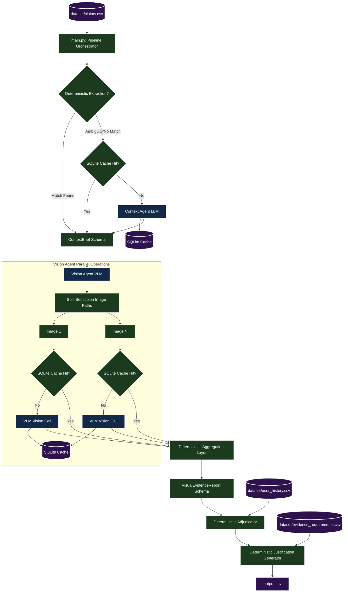

# Multi-Agent Damage Claim Verification Pipeline

This package implements a production-quality, local multi-agent claim verification system that evaluates damage claims from text conversations and image evidence.

The pipeline utilizes **Ollama** or cloud API providers for model inference and runs a deterministic adjudication layer written in Python to ensure 100% decision consistency and rule compliance.

---

## System Architecture



---

## 1. Directory Structure

```text
code/
├── main.py                       # Pipeline Orchestrator & CLI entry point
├── requirements.txt              # Project package dependencies
├── README.md                     # Documentation (this file)
├── agents/
│   ├── __init__.py
│   ├── context_agent.py          # Context Agent (extracts claimed issue/part)
│   ├── vision_agent.py           # Vision Agent (audits image evidence)
│   ├── adjudicator.py            # Adjudication Layer (deterministic decision rules)
│   └── justification_agent.py     # Justification Agent (writes decisions text)
├── schemas/
│   ├── __init__.py
│   └── claim_schemas.py          # Pydantic data schemas
├── utils/
│   ├── __init__.py
│   ├── cache.py                  # WAL-mode SQLite caching layer
│   ├── retry.py                  # Async retry backoff decorator
│   └── helpers.py                # CSV lookups and normalization helpers
├── evaluation/
│   ├── __init__.py
│   ├── evaluation.py             # Accuracy evaluation script
│   └── evaluation_report.md      # Generated evaluation report
└── cache/                        # Cached SQLite database folder
```

---

## 2. Prerequisites & Setup

### 2.1 Install Ollama
Download and install Ollama from [ollama.com](https://ollama.com). Ensure the Ollama service is running locally (`http://localhost:11434`).

### 2.2 Pull Required Models
Run the following commands in your shell to download the models:

```bash
# Text extraction and justification model
ollama pull qwen2.5

# Multi-modal vision model for auditing images
ollama pull qwen2.5-vl
```

### 2.3 Install Python Dependencies
Install the required packages:

```bash
pip install -r requirements.txt
```

### 2.4 Configure Environment Variables
Copy `.env.example` to `.env` in the project root and adjust settings as needed:

```bash
# On Windows (Command Prompt or PowerShell)
copy .env.example .env

# On macOS or Linux (Terminal)
cp .env.example .env
```

Open `.env` to configure your custom environment parameters:
- `OLLAMA_BASE_URL`: Local connection URL (default `http://localhost:11434`).
- `VISION_MODEL` / `TEXT_MODEL`: Locally pulled Ollama model names.
- `MAX_CONCURRENT_VISION_TASKS` / `MAX_CONCURRENT_TEXT_TASKS`: Concurrency semaphores.
- `CACHE_DB_PATH`: SQLite database storage location.

### 2.5 Model Generation Parameters & Determinism
To perform accurate, consistent claim verification audits, the models are configured to favor **determinism** and **repeatability** over creativity:
- **Zero Temperature (`0.0`)**: Forces greedy decoding where the model always chooses the highest-probability next token, minimizing response variation between runs.
- **Low Top_p (`0.1`)**: Restricts sampling to the top 10% cumulative probability distribution, mitigating hallucination risks.
- **Larger Context Window (`8192`)**: Ensures the models have adequate workspace memory to hold long claim transcripts and VLM-generated visual descriptions.

**How to Override for Experiments:**
If you wish to test different levels of creativity (e.g. to evaluate the quality of text justifications), you can open `.env` and adjust the parameters (e.g. set `TEXT_MODEL_TEMPERATURE=0.3` and `TEXT_MODEL_TOP_P=0.9`). The pipeline will automatically load and apply these settings at startup.


---

## 3. Usage

All commands should be executed from the **repository root directory** to ensure Python module paths resolve correctly.

### 3.1 Running the Main Pipeline

#### On Windows (PowerShell):
```powershell
python -m code.main `
  --claims dataset/claims.csv `
  --history dataset/user_history.csv `
  --requirements dataset/evidence_requirements.csv `
  --output output.csv
```

#### On macOS / Linux (Terminal) or Windows (Git Bash):
```bash
python -m code.main \
  --claims dataset/claims.csv \
  --history dataset/user_history.csv \
  --requirements dataset/evidence_requirements.csv \
  --output output.csv
```

**Available CLI Flags:**
- `--claims`: Path to claims dataset CSV (default: `dataset/claims.csv`).
- `--history`: Path to user history CSV (default: `dataset/user_history.csv`).
- `--requirements`: Path to evidence requirements CSV (default: `dataset/evidence_requirements.csv`).
- `--output`: Path to write output predictions CSV (default: `output.csv`).
- `--text-model`: Model for text tasks (default: `qwen2.5`).
- `--vision-model`: Model for vision tasks (default: `qwen2.5-vl`).
- `--workers`: Number of parallel claims to process concurrently.
- `--disable-cache`: Disable caching.

### 3.2 Running the Evaluation Script
Evaluate accuracy and retrieve operational metrics on the development set:

```bash
python -m code.evaluation.evaluation
```

This generates `code/evaluation/evaluation_report.md` detailing operational performance, token usage, throughput, and field accuracies for:
- `claim_status`
- `issue_type`
- `object_part`
- `severity`

---

## 4. Key Design Implementations

1. **Deterministic Decisions**: All final decisions (`claim_status`, `evidence_standard_met`) are calculated deterministically in Python using the adjudicator module. Models are reserved solely for extraction, image auditing, and text formulation.
2. **Individual Image Analysis**: Images in multi-image claims are analyzed independently by Qwen2.5-VL to prevent detail mix-ups, followed by a deterministic aggregation.
3. **Resilient SQLite Caching**: SQLite cache queries use Write-Ahead Logging (WAL) mode to permit concurrent read/write transactions without lockouts.
4. **Jittered Exponential Backoff**: Prevents thundering herd resource lockups by introducing jitter delays when retrying failed model calls.
